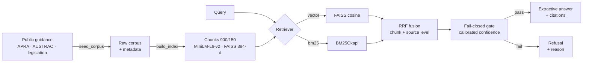
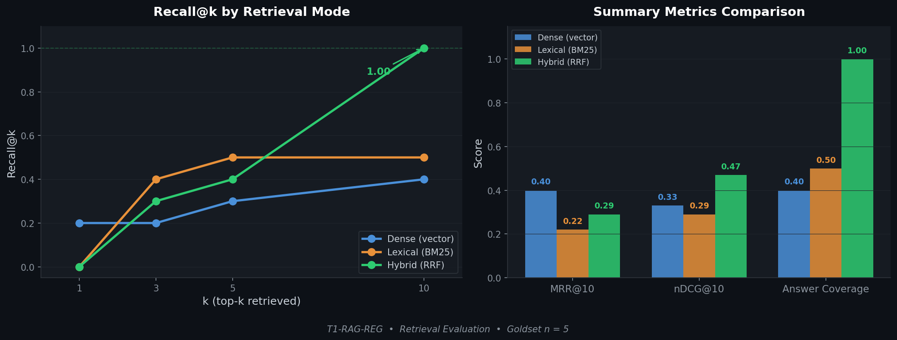

# T1-RAG-REG — Evaluation-First Regulatory RAG

> A retrieval-augmented question-answering system over public Australian financial-regulation guidance (APRA + AUSTRAC), built around **measured retrieval quality** and a **fail-closed** answering policy: it refuses rather than guesses when the evidence is weak.


-555)


Most RAG demos wire an LLM to a vector store and stop there. The harder — and more *regulated-industry-relevant* — problems are: did retrieval actually surface the right source, and what does the system do when it didn't? T1-RAG-REG is built around those two questions. It ships an information-retrieval evaluation harness (Recall / MRR / nDCG), a hybrid retriever with reciprocal-rank fusion, and an answer layer that returns cited extracts or an explicit refusal — never an unsupported claim.

---

## Why this design

In a compliance setting, a confidently-wrong answer is worse than no answer. The system is therefore built to be:

- **Inspectable** — every answer carries its source citations and a calibrated confidence score; a `/debug/retrieve` endpoint exposes the raw ranking.
- **Reproducible** — the corpus is public, the index build is deterministic, and the evaluation is a single command that writes a timestamped report.
- **Fail-closed** — if the best retrieved chunk scores below a configurable gate, the system refuses with a machine-readable reason instead of answering.
- **Dependency-light** — answers are produced **extractively** (sentence selection from retrieved chunks), so the core path needs **no external LLM API**, no API keys, and no per-query cost. Embeddings run locally via `sentence-transformers`.

**Non-goals:** this is not legal advice, uses only public guidance (no internal/restricted data), and makes no "zero hallucination" claims.

---

## Architecture



**Pipeline:** fetch public pages → extract main text → chunk with overlap → embed locally → index in FAISS → retrieve → gate → answer or refuse. Evaluation runs against the same retrieve path and gates CI.

### Retrieval modes
| Mode | What it does |
|---|---|
| `vector` | Dense FAISS search over normalized MiniLM embeddings (cosine). |
| `bm25` | Lexical `BM25Okapi` over a deterministic tokenizer. |
| `hybrid_rrf` | Reciprocal Rank Fusion of dense + lexical, fused **at source level** so one long page can't dominate top-k. |

All modes apply **deterministic query rewriting** (regulatory-term expansion, no LLM), **low-quality-source filtering**, and feed the same **per-mode confidence calibration** that maps raw scores into a comparable `[0,1]` band before the fail-closed gate.

---

## Quickstart

### Docker (recommended)
```bash
cp .env.example .env
docker compose up --build        # serves on http://localhost:8000
```

### Local (Python 3.11)
```bash
python -m venv .venv && . .venv/bin/activate    # Windows: .venv\Scripts\activate
pip install -r requirements.txt
cp .env.example .env

# 1. seed the public corpus (APRA + AUSTRAC + AML/CTF Act)
python -m scripts.seed_corpus

# 2. build the FAISS index + chunks
python -m scripts.build_index_from_corpus

# 3. serve
uvicorn app.main:app --reload
```

> The committed index lets you skip steps 1–2 and query immediately. Re-seed only to refresh the corpus.

### API
| Method | Path | Purpose |
|---|---|---|
| `GET` | `/health` | Liveness check. |
| `POST` | `/query` | Retrieve + extractive answer (typed request). |
| `POST` | `/answer` | Same, accepts a free-form JSON body. |
| `POST` | `/debug/retrieve` | Raw ranked hits + gate decision, no answering. |
| `GET` | `/debug/build` | Active config + calibration bands (proves which build is running). |

---

## Example output

Real responses from the running system — not mocked.

### Successful answer

```bash
curl -X POST localhost:8000/query \
  -H "content-type: application/json" \
  -d '{"q":"Who must enrol with AUSTRAC?","mode":"hybrid_rrf","top_k":5}'
```

```json
{
  "status": "ok",
  "mode": "hybrid_rrf",
  "answer": "As a provider of designated services, you must comply with the law to help prevent money laundering, terrorism financing and other serious crime.",
  "calibrated_confidence": 0.86,
  "citations": [
    {
      "title": "Enrol or register | AUSTRAC",
      "url": "https://www.austrac.gov.au/business/new-to-austrac/enrol-or-register"
    },
    {
      "title": "Your obligations | AUSTRAC",
      "url": "https://www.austrac.gov.au/business/new-to-austrac/your-obligations"
    }
  ]
}
```

The answer is **extracted directly from retrieved chunks** (not generated), with source URLs the reader can verify. Confidence is calibrated per-mode into a `[0,1]` band — here 0.86, well above the 0.50 gate.

### Fail-closed refusal

```bash
curl -X POST localhost:8000/query \
  -H "content-type: application/json" \
  -d '{"q":"What is the weather in Sydney?","mode":"hybrid_rrf","top_k":5}'
```

```json
{
  "status": "refused",
  "reason": "insufficient_retrieval_confidence",
  "stage": "retrieval",
  "calibrated_confidence": 0.42,
  "min_calib_conf_gate": 0.50
}
```

The query is out of domain. Calibrated confidence (0.42) falls below the gate (0.50), so the system **refuses explicitly** with a machine-readable reason instead of fabricating an answer. This is the fail-closed design in action.

> Full response bodies including calibration metadata: [`examples/`](examples/)

---

## Evaluation

The point of the project. Retrieval is scored against a goldset of regulatory questions, each labelled with the source document(s) that *should* be retrieved.

### How to run

```bash
python -m app.eval.run_eval --mode hybrid_rrf --ks 1,3,5,10
python -m app.eval.report_plots         # writes Recall/MRR/nDCG plots + summary
python -m app.eval.smoke_eval           # CI gate: fails if answer_coverage < 0.95
```

Each run writes a timestamped `eval_report_<mode>_<ts>.json` and a per-query CSV to `reports/`, plus an updated leaderboard.

### Results — three retrieval modes compared (goldset n = 5)

| Mode | Recall@1 | Recall@3 | Recall@5 | Recall@10 | MRR@10 | nDCG@10 | Coverage |
|---|---:|---:|---:|---:|---:|---:|---:|
| **Dense (vector)** | 0.20 | 0.20 | 0.30 | 0.40 | **0.40** | 0.33 | 0.40 |
| **Lexical (BM25)** | 0.00 | 0.40 | 0.50 | 0.50 | 0.22 | 0.29 | 0.50 |
| **Hybrid (RRF)** | 0.00 | 0.30 | 0.40 | **1.00** | 0.29 | **0.47** | **1.00** |



### What the numbers show

With n = 5, these are directional, not statistical — but the pattern is clear:

- **Hybrid RRF achieves perfect recall at k=10** — every gold source is in the candidate pool. Neither dense nor lexical alone reaches this. RRF fusion compensates for each mode's blind spots.
- **Dense ranks best** (highest MRR) — when it finds the right source, it puts it near the top. But it misses sources that BM25 catches via exact keyword match.
- **BM25 surfaces sources dense misses** (wider recall@3–5) but ranks them poorly.
- **The gap is in ranking, not coverage.** MRR/nDCG have headroom while recall@10 is saturated. A cross-encoder re-ranker is the next lever — added to the roadmap.

Goldset expansion beyond n = 5 is in progress for statistically meaningful confidence intervals.

---

## Corpus

Public Australian regulatory guidance only, crawled from official domains:

- **APRA** — prudential policy.
- **AUSTRAC** — AML/CTF programs, customer identification & verification (KYC), reporting (SMR), enrolment/registration obligations.
- **legislation.gov.au** — AML/CTF Act series.

Indexed snapshot: **132 source documents → 4,207 chunks** (900-char chunks, 150-char overlap), embedded with `all-MiniLM-L6-v2` (384-d), stored in FAISS. See `data/index/stats.json` for the exact build manifest.

---

## Testing

```bash
pytest -v                        # 7 tests: health endpoint, config, imports, calibration, query rewrite
```

```
app/tests/test_health.py::test_health_returns_ok             PASSED
app/tests/test_health.py::test_debug_build_returns_config    PASSED
app/tests/test_import_eval.py::test_import_main              PASSED
app/tests/test_import_eval.py::test_import_retriever         PASSED
app/tests/test_import_eval.py::test_import_bm25              PASSED
app/tests/test_import_eval.py::test_import_calibration       PASSED
app/tests/test_import_eval.py::test_import_query_rewrite     PASSED
```

CI runs tests on every push via GitHub Actions. Lint (ruff + black) is available locally via `make lint`.

---

## Project structure
```
app/
  main.py            FastAPI app: /query /answer /debug/* + global JSON error handling
  rag/
    retriever.py     vector / bm25 / hybrid_rrf + RRF + source-level fusion
    bm25.py          BM25Okapi index + tokenizer
    extractive.py    citation-grounded extractive answering
    answer.py        answer assembly helpers
    calibration.py   per-mode raw-score -> confidence bands
    query_rewrite.py deterministic regulatory query expansion
    ingest.py        fetch + clean + chunk
  eval/
    run_eval.py      Recall / MRR / nDCG / answer_coverage runner
    report_plots.py  plots + markdown summary
    smoke_eval.py    CI quality gate
    dashboard.py     Streamlit eval explorer
    eval_dataset.jsonl   retrieval goldset (source-labelled)
  tests/
    test_health.py        endpoint smoke tests
    test_import_eval.py   import + unit tests
scripts/
  seed_corpus.py             crawl public guidance
  build_index_from_corpus.py chunk + embed + FAISS
  run_eval.py                end-to-end eval against a live API
examples/
  query_success.json         real successful answer (full response body)
  query_refusal.json         real fail-closed refusal (full response body)
data/eval/questions.jsonl    answer-content questions
reports/                     evaluation outputs (leaderboard + summaries)
```

---

## Tech stack
FastAPI · Uvicorn · Pydantic · FAISS (`faiss-cpu`) · `sentence-transformers` (MiniLM-L6-v2) · `rank-bm25` · trafilatura/BeautifulSoup (ingestion) · pandas + matplotlib (eval/plots) · Streamlit (eval dashboard) · Docker. Lint/format/test: ruff · black · pytest.

## Roadmap
- Expand the retrieval goldset beyond n = 5 for statistically meaningful metrics.
- Add a cross-encoder re-ranking pass to lift MRR/nDCG (recall is already saturated at k=10).
- Scheduled corpus refresh with index-diff reporting.

## Disclaimer
Informational only; **not legal or compliance advice.** Built on public guidance that may change — always verify against the primary source.

## License
MIT — see `LICENSE`.
